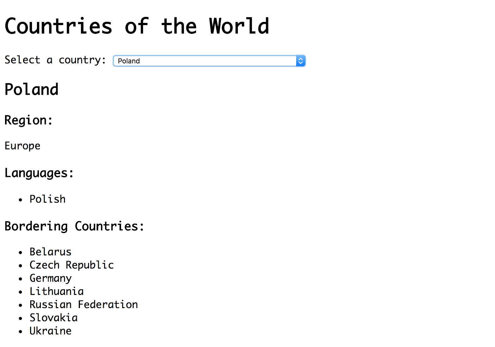

# Requests and Navigating Data Structures: Bordering Countries App

### Learning Objectives

- Be able to make an `XMLHttpRequest` to receive data
- Be able to navigate JSON data structures
- Be able to implement nested views using the pub/sub pattern

## Brief

Your task is to create an app that allows users to select a country from a drop-down to see information about it.

*Screenshot of resulting application*

Use the start point provided and use the [Rest Countries API](https://restcountries.eu/) as your data source.

### MVP

- Create a select populated with the name of the countries.
- When a user selects a country from the drop-down, display the country's:
  - name
  - region
  - list of languages

### Extensions

- Refactor code to ensure methods are small and adhere to the single responsibility principle where appropriate
- In addition to displaying the country's name, region and languages, display a list of names of its bordering countries.

### Considerations

When displaying the country's list of languages and list of bordering countries, try to use nested views, by creating a separate view responsible for rendering the lists.

For the extension task, look at the data the API returns to think about how you are going to find a country's bordering countries. **Hint: The `alpha3Code` property on a country will match the bordering country code.** What is going to be responsible for finding the bordering countries?

### Planning

Draw a diagram of your files, detailing:

- the publishing of and subscribing to events.
- the flow of data through the application.
- the hierarchy of view rendering responsibility
